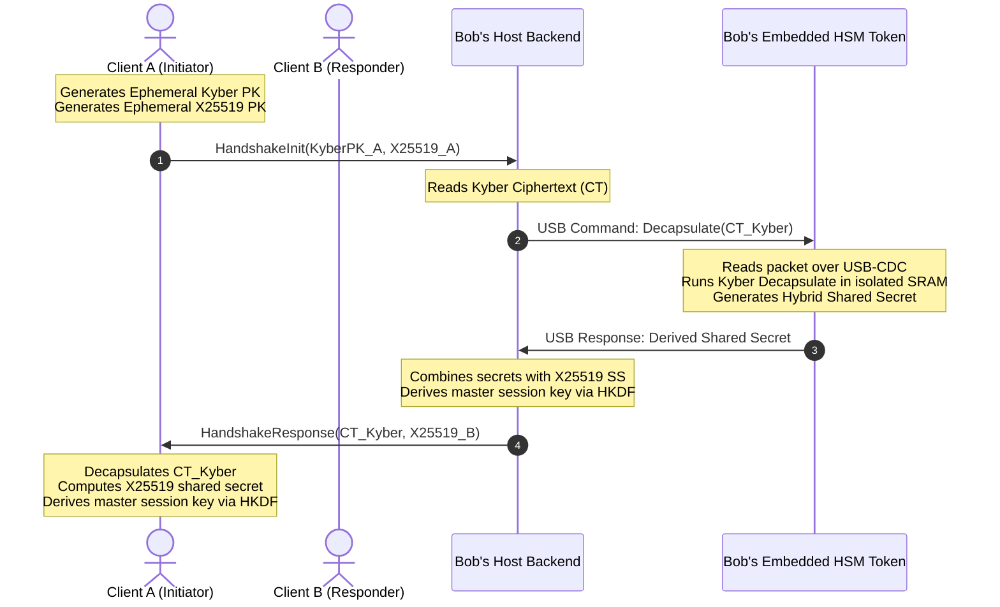

# System Architecture: Q-Safe Gateway

This document outlines the software and hardware architecture for the Q-Safe secure messaging system. It defines the workspace boundaries, data flows, communication protocols, failure modes, and observability specs.

## 1. High-Level Architecture

Q-Safe is built as a multi-tier systems architecture. The key components include a stateless API gateway, a real-time WebSocket messaging module, and a bare-metal Hardware Security Module (HSM) microcontroller running bare-metal Rust.

To support local testing without requiring physical microcontrollers, the gateway includes a mock serial interface driver that simulates USB transmissions on the host.

```mermaid
graph TD
    Client[Web/Desktop Client] <-->|HTTPS / WebSockets| API[API Gateway / Axum]
    
    subgraph Host Server (host-server)
        API <-->|Tokio Channels| WS[WebSocket Manager]
        API <-->|Orchestration| Auth[Auth Service]
        API <-->|Orchestration| Msg[Messaging Service]
        
        Msg <-->|Compute| Crypto[Hybrid Crypto Engine]
        
        %% USB Interface Layer
        Crypto <-->|serialport-rs| Serial[USB Serial Driver]
        Crypto <-->|In-Memory Mock| Mock[HIL Hardware Simulator]
    end
    
    subgraph Embedded Security Token (firmware)
        Serial <-->|Physical USB CDC| Pico[RP2040 Microcontroller]
        Pico <-->|Crypto Core| HW_Kyber[Hardware-Isolated Kyber-KEM]
        Pico <-->|Entropy| HW_TRNG[Hardware Random Generator]
    end
    
    subgraph Storage Tier
        Auth -->|SQLx Client| DB[(PostgreSQL)]
        Msg -->|SQLx Client| DB
    end
```

## 2. Component Boundaries & Workspace Layout

The project is structured as a Cargo Workspace to enforce compilation rules across different target architectures (x86_64 server hosts and thumbv6m microcontroller cores).

```
qsafe/ (Workspace Root)
├── host-server/             # Axum gateway & service core (Target: Host OS)
│   ├── src/
│   │   ├── main.rs          # Server initialization & route mapping
│   │   ├── auth.rs          # JWT & Argon2id service Orchestrator
│   │   ├── database.rs      # SQLx database execution client
│   │   ├── crypto.rs        # Crypto routing gateway (checks for hardware connection)
│   │   ├── hardware.rs      # serialport-rs interface & TLV framing parser
│   │   └── websocket.rs     # Async WebSocket loop using channels
├── firmware/                # Bare-metal Embedded Rust firmware (Target: RP2040)
│   ├── src/
│   │   └── main.rs          # Embassy async event loop & hardware register handler
├── common/                  # Shared library crate (Target: Dual-compatible)
│   ├── src/
│   │   └── lib.rs           # Packet structs, CRC-16 utility, & serial type definitions
```

## 3. Communication Sequence: Hybrid Handshake

The cryptographic handshake sequence coordinates the client, host server, and the embedded HSM device over USB-CDC:



## 4. Failure Modes & Mitigations

- **USB Disconnect / Device Crash**:
  * *Impact*: The hardware engine becomes unreachable mid-flight.
  * *Mitigation*: The host serial driver monitors read/write bounds with a 500ms timeout threshold. On timeout, it falls back to software cryptographic emulation and generates security warning logs.
- **Serial Transmission Byte Corruption**:
  * *Impact*: Bit flips over the UART lines break key variables.
  * *Mitigation*: The communication protocol wraps payloads in a Type-Length-Value (TLV) frame validated by a CRC-16 checksum. Corrupt frames are discarded, and the receiver requests a frame retransmission.
- **Database Connection Failure**:
  * *Impact*: Endpoint handlers fail to verify sessions or save messaging history.
  * *Mitigation*: Integrate SQLx connection pooling with retry limits and health-checking loops to prevent system-wide lockups.

## 5. Observability Specifications

To manage, trace, and debug the system in production, Q-Safe implements three core observability layers:

### Structured Logging & Tracing
- **Framework**: Built on the `tracing` and `tracing-subscriber` crates.
- **Output Format**: JSON formatted logs printed to standard output for ingestion by log collectors.
- **Correlation**: Every HTTP request and active WebSocket session generates a unique `request_id` context. This ID is propagated through the task runtime to correlate log lines for database queries, handshake steps, and frame dispatch routines.
- **Safety Bounds**: The logging engine enforces a strict filter: zero raw password data, session keys, or raw cryptographic secrets are logged under any severity level.

### Metrics Exporter
- **Endpoint**: Exposes `/metrics` in standard Prometheus text format.
- **Custom Instrumentation**:
  - `qsafe_websocket_active_connections`: Gauge tracking active client WebSocket sockets.
  - `qsafe_hsm_request_duration_seconds`: Histogram tracking the execution latency of USB HSM operations.
  - `qsafe_api_http_request_duration_seconds`: Histogram tracking Axum routing latency.

### System Health Monitoring
- **Endpoint**: `/api/health` returning details on downstream system states:
  - **Database Status**: Connective health checks via SQLx pool probes.
  - **HSM Status**: Checking if the serial driver successfully reads from the target USB port or is running on software fallback.
