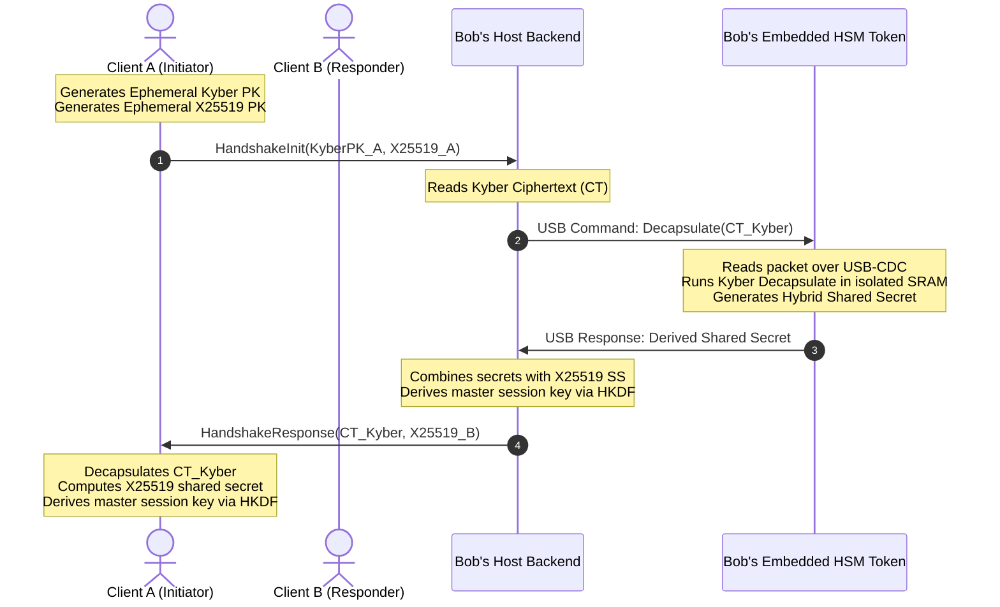

# System Architecture: Q-Safe Gateway

This document outlines the software and hardware architecture for the Q-Safe secure messaging system. It defines the workspace boundaries, data flows, communication protocols, failure modes, and observability specs.

## 1. High-Level Architecture

Q-Safe is built as a multi-tier systems architecture. The key components include a stateless API gateway, a real-time WebSocket messaging module, and a bare-metal Hardware Security Module (HSM) microcontroller running bare-metal Rust.

To support local testing without requiring physical microcontrollers, the gateway includes a mock serial interface driver that simulates USB transmissions on the host.

```mermaid
graph TD
    Client[Web/Desktop Client] <-->|HTTPS / WebSockets| API[API Gateway / Axum]
    
    subgraph Host Server (host-server)
        API <-->|Tokio Channels| WS[WebSocket Manager]
        API <-->|Orchestration| Auth[Auth Service]
        API <-->|Orchestration| Msg[Messaging Service]
        
        Msg <-->|Compute| Crypto[Hybrid Crypto Engine]
        
        %% USB Interface Layer
        Crypto <-->|serialport-rs| Serial[USB Serial Driver]
        Crypto <-->|In-Memory Mock| Mock[HIL Hardware Simulator]
    end
    
    subgraph Embedded Security Token (firmware)
        Serial <-->|Physical USB CDC| Pico[RP2040 Microcontroller]
        Pico <-->|Crypto Core| HW_Kyber[Hardware-Isolated Kyber-KEM]
        Pico <-->|Entropy| HW_TRNG[Hardware Random Generator]
    end
    
    subgraph Storage Tier
        Auth -->|SQLx Client| DB[(PostgreSQL)]
        Msg -->|SQLx Client| DB
    end
```

## 2. Component Boundaries & Workspace Layout

The project is structured as a Cargo Workspace to enforce compilation rules across different target architectures (x86_64 server hosts and thumbv6m microcontroller cores).

```
qsafe/ (Workspace Root)
├── host-server/             # Axum gateway & service core (Target: Host OS)
│   ├── src/
│   │   ├── main.rs          # Thin entrypoint: load config, build state, serve
│   │   ├── app.rs           # AppState, HTTP handlers, and router construction
│   │   ├── auth.rs          # JWT & Argon2id service
│   │   ├── database.rs      # SQLx database execution client
│   │   ├── crypto.rs        # Crypto primitives (Kyber/X25519/Ed25519/HKDF) - unit-tested, not yet wired to any endpoint beyond the HSM path
│   │   ├── handshake.rs, qkd.rs, qrng.rs  # Designed-but-unwired hybrid handshake + decoy-check protocol (see docs/HYBRID_KEY_EXCHANGE.md)
│   │   ├── hardware.rs      # HsmConnection trait: MockHsmConnection (tested) + PhysicalHsmConnection (serialport-rs, untested against real hardware)
│   │   └── websocket.rs     # Async WebSocket loop using channels
├── firmware/                # Reserved for RP2040 firmware (Target: thumbv6m-none-eabi)
│   ├── src/
│   │   └── main.rs          # Currently an empty panic-handler stub - no USB/Kyber/QRNG logic exists yet (see docs/HSM_VERIFICATION_STATUS.md)
├── common/                  # Shared library crate (Target: Dual-compatible)
│   ├── src/
│   │   └── lib.rs           # Packet structs, CRC-16 utility, & serial type definitions
```

## 3. Communication Sequence: Hybrid Handshake

The cryptographic handshake sequence coordinates the client, host server, and the embedded HSM device over USB-CDC:



## 4. Failure Modes & Mitigations

- **USB Disconnect / Device Crash**:
  * *Impact*: The hardware engine becomes unreachable mid-flight.
  * *Actual behavior today*: `PhysicalHsmConnection` uses a 2-second read/write timeout (`host-server/src/hardware.rs`) and returns an error on failure - the caller (e.g. the `/api/auth/register` handler) surfaces that as a 500. There is **no automatic runtime fallback to the Mock HSM on failure** - `HSM_MOCK` selects Mock vs. Physical once at process startup (`AppState::build`), not per-request. A prior version of this document described a dynamic software-fallback path; that was aspirational, not implemented, and has been corrected here.
- **Serial Transmission Byte Corruption**:
  * *Impact*: Bit flips over the UART lines break key variables.
  * *Mitigation*: The communication protocol wraps payloads in a Type-Length-Value (TLV) frame validated by a CRC-16 checksum. Corrupt frames are discarded (`qsafe_common::decode_packet` returns an error) - there is no automatic retransmission request today, the caller just sees the error.
- **Database Connection Failure**:
  * *Impact*: Endpoint handlers fail to verify sessions or save messaging history.
  * *Actual behavior today*: `sqlx`'s connection pool (sized via `DB_MAX_CONNECTIONS`) will retry acquiring a connection up to its own internal defaults; there is no application-level retry policy or circuit breaker layered on top, and no query timeout is configured, so a hung query can hold a pool slot indefinitely.

## 5. Known Limitations

Findings from an engineering audit of this repository, kept here rather than only in a commit message so they stay visible:

- **`WebSocketRegistry` is single-instance only.** Presence and message routing live in an in-process `HashMap` behind an actor (`host-server/src/websocket.rs`). Running more than one replica of this server means users connected to different instances cannot reach each other over WebSocket - there is no pub/sub fan-out (Redis, NATS, etc.) between instances.
- **The rate limiter is not proxy-aware.** `tower_governor`'s `PeerIpKeyExtractor` (the default, used on `/api/auth/*`) keys on the raw TCP peer address. Behind any real production topology (load balancer, reverse proxy, CDN) that address is the proxy, not the end client, so the "per-IP" limit becomes a single shared bucket for every user behind that proxy. Swapping to a header-trusting extractor (e.g. `SmartIpKeyExtractor`) is a security tradeoff of its own (spoofable headers unless the upstream proxy is guaranteed trusted), not a drop-in fix, and hasn't been made.
- **`chat_sessions` is unused schema.** The table (`participants UUID[]`, `shared_key BYTEA`) exists in `migrations/0001_init.sql` but no handler ever reads or writes it - it's drift from an earlier design where sessions were meant to be persisted server-side. `messages.session_id` no longer references it (see `migrations/0004_drop_dead_session_fk.sql`) - `session_id` is just a client-supplied correlation UUID.
- **No message idempotency.** `POST /api/messages/send` has no idempotency key; a client retry after a timeout sends a duplicate message.
- **No API versioning.** All routes are under `/api/...` with no version segment.

## 5. Observability Specifications

To manage, trace, and debug the system in production, Q-Safe implements three core observability layers:

### Structured Logging & Tracing
- **Framework**: Built on the `tracing` and `tracing-subscriber` crates.
- **Output Format**: JSON formatted logs printed to standard output for ingestion by log collectors.
- **Correlation**: Every HTTP request and active WebSocket session generates a unique `request_id` context. This ID is propagated through the task runtime to correlate log lines for database queries, handshake steps, and frame dispatch routines.
- **Safety Bounds**: The logging engine enforces a strict filter: zero raw password data, session keys, or raw cryptographic secrets are logged under any severity level.

### Metrics Exporter
- **Endpoint**: Exposes `/metrics` in standard Prometheus text format.
- **Custom Instrumentation** (the only three metrics actually emitted - see `host-server/src/websocket.rs`):
  - `qsafe_active_websocket_connections`: Gauge tracking active client WebSocket sockets.
  - `qsafe_messages_sent_total`: Counter for messages delivered to an online recipient.
  - `qsafe_messages_buffered_total`: Counter for messages buffered because the recipient was offline.
  - There is currently no per-request HTTP latency histogram or HSM-operation-latency metric, despite `tower_governor`/`TraceLayer` providing the request-tracing infrastructure those would build on.

### System Health Monitoring
- **Endpoint**: `/api/health` returning details on downstream system states:
  - **Database Status**: Connective health checks via SQLx pool probes.
  - **HSM Status**: Checking if the serial driver successfully reads from the target USB port or is running on software fallback.
