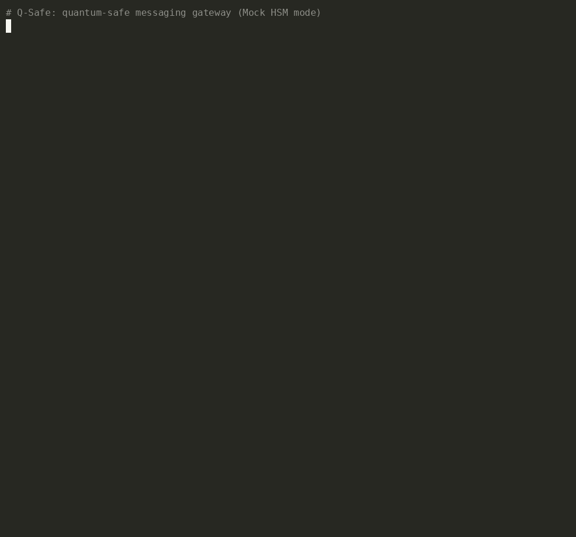

# Q-Safe: Quantum-Safe Messaging Gateway

[](https://github.com/s7g4/qsafe/actions/workflows/ci.yml)
[](https://s7g4.github.io/qsafe/)
[](LICENSE)

**[Docs site: s7g4.github.io/qsafe](https://s7g4.github.io/qsafe/)**

<!-- ANCHOR: intro -->
Q-Safe is a Rust messaging gateway exploring post-quantum hybrid cryptography
(ML-KEM / FIPS 203 + X25519) with a pluggable Hardware Security Module (HSM)
abstraction for offloading key decapsulation.

**Host-side crypto and auth: tested and complete.** The ML-KEM-768/X25519
hybrid crypto core, Argon2id auth, and dual-JWT session flow are covered by
real integration tests (see below). **Hardware path: in progress.** The
RP2040 firmware that would run on physical HSM hardware doesn't exist yet -
the host-side driver and protocol are ready for it, but there's no firmware
to flash. See [docs/HSM_VERIFICATION_STATUS.md](docs/HSM_VERIFICATION_STATUS.md)
for the exact, up-to-date breakdown of what's proven vs. unverified vs.
unimplemented.
<!-- ANCHOR_END: intro -->

## Demo

<!-- ANCHOR: demo -->


Every line of output above is a real capture (`docker`, `curl`, `cargo run`,
`cargo test`) against a locally running instance in Mock HSM mode - nothing
staged. Typing is sped up; command output is not edited except truncating
JWTs for readability.
<!-- ANCHOR_END: demo -->

## Architecture

The project is a Cargo Workspace spanning host and embedded targets:
- `host-server/`: The messaging backend built on Axum, managing WebSocket routing, PostgreSQL (SQLx) storage, authentication, and HTTP endpoints.
- `firmware/`: Reserved for RP2040 firmware. Currently an empty `#![no_std]` stub with no dependencies - see [docs/HSM_VERIFICATION_STATUS.md](docs/HSM_VERIFICATION_STATUS.md).
- `common/`: Shared Type-Length-Value (TLV) packet definitions compiled for both host and device targets, enabling zero-copy `#[no_std]` serial communication.

<!-- ANCHOR: whats-tested -->
## What's actually tested

- **Post-quantum crypto core**: ML-KEM-768 (Kyber) key generation, encapsulation, and decapsulation, exercised through the `HsmConnection` abstraction end-to-end, including a tampered-ciphertext case (`host-server/tests/hsm_mock_flow.rs`); and directly at the `CryptoEngine` level - Kyber round-trip, X25519 shared-secret agreement, the HKDF-SHA3-256 hybrid key derivation matching on both sides, and Ed25519 sign/verify including tampered-message and wrong-key rejection (`host-server/src/crypto.rs` unit tests).
- **Auth flow, over real HTTP against a real Postgres database**: Argon2id password hashing (correct/incorrect password), dual-JWT issuance, refresh-token rotation, and query-based WebSocket token authorization (valid/missing/invalid token). See `host-server/tests/auth_flow.rs`. JWT expiry/signature rejection is covered by unit tests in `host-server/src/auth.rs`.
- **TLV packet framing + CRC-16-CCITT** in `common/`, shared by both the host driver and (eventually) the firmware.

What is **not** tested or implemented: the physical RP2040 HSM path (no firmware exists yet), refresh-token revocation (rotation issues a new token but never invalidates the old one - there's no server-side token store), and the QKD/decoy-check handshake protocol in `handshake.rs`/`qkd.rs` (implemented but not wired to any HTTP endpoint).
<!-- ANCHOR_END: whats-tested -->

<!-- ANCHOR: features -->
## Features (with the caveats above)

- **Post-Quantum Cryptography**: Module-Lattice KEM (ML-KEM / FIPS 203) integrated with X25519 for hybrid key exchange.
- **Hardware Security Module abstraction**: A `HsmConnection` trait with a fully-tested in-memory Mock HSM for local development, and a `PhysicalHsmConnection` serial driver that is implemented and compiles but has never been run against real hardware (no firmware exists to talk to it yet).
- **Authentication**: Argon2id password hashing, Dual-JWT architecture (short-lived access + secure HttpOnly refresh), and query-based WebSocket token authorization.
- **Hardened Security**: Rate limiting via `tower_governor` (peer-IP keyed - requires the server to be served with connect-info, which `main.rs` now does), memory exhaustion protection (bounded channels), leaky-error sanitization, and configurable CORS.
- **Graceful Shutdown**: Active request handling during SIGTERM/CTRL+C restarts.
- **Observability**: Prometheus metrics (`/metrics`) tracking latencies, connections, and hardware throughput, paired with `tracing` spans and `x-request-id` headers.
- **Deployment**: Multi-stage Dockerfile and `docker-compose.yml` for isolated deployment alongside PostgreSQL 16.
<!-- ANCHOR_END: features -->

<!-- ANCHOR: getting-started -->
## Getting Started

### Local Development (Mock HSM)

1. **Start the database**:
   ```bash
   docker-compose up -d postgres
   ```
2. **Setup Environment**:
   Copy `.env.example` to `.env` and fill in the secrets. Ensure `HSM_MOCK=true`.
3. **Run the API**:
   ```bash
   cargo run -p qsafe-backend
   ```
4. **Run the tests** (requires a reachable Postgres, e.g. the one from step 1, or override `DATABASE_URL`):
   ```bash
   cargo test -p qsafe-backend -p qsafe-common
   ```

### Deployment

`HSM_MOCK=false` / physical HSM mode is **not yet functional** - see
[docs/HSM_VERIFICATION_STATUS.md](docs/HSM_VERIFICATION_STATUS.md). The
Docker Compose deployment below runs the Mock HSM path.

```bash
docker-compose up -d --build
```
<!-- ANCHOR_END: getting-started -->

## Documentation

All of the documentation below is also published as a single browsable
mdBook - see [docs/book/](docs/book/) to build it locally
(`mdbook build docs/book`, or `mdbook serve docs/book` to preview), or once
[GitHub Pages is enabled for this repo](https://docs.github.com/en/pages/getting-started-with-github-pages/configuring-a-publishing-source-for-your-github-pages-site)
(Settings -> Pages -> Source: "GitHub Actions"), it auto-deploys on every
push to `master` via `.github/workflows/docs.yml`.

- **[API_DOCUMENTATION.md](API_DOCUMENTATION.md)**: Complete REST and WebSocket endpoint specifications for integrating with the gateway.
- **[ARCHITECTURE.md](ARCHITECTURE.md)**: High-level architectural specifications, data flows, hardware integration boundaries, and observability metrics.
- **[docs/HSM_VERIFICATION_STATUS.md](docs/HSM_VERIFICATION_STATUS.md)**: What's proven vs. unverified vs. unimplemented in the HSM path.
- **[docs/HYBRID_KEY_EXCHANGE.md](docs/HYBRID_KEY_EXCHANGE.md)**: Technical writeup of the ML-KEM-768 + X25519 hybrid key exchange design.
- **[CHANGELOG.md](CHANGELOG.md)**: Semantic version tracking and updates record.
- **[METRICS.md](METRICS.md)**: Latency limits, memory zeroization parameters, binary overhead budgets, testing strategy, and CI/CD pipelines.
- **[docs/adr/](docs/adr/)**: Architectural Decision Records (ADRs) tracking design updates and transitions.
- **[DEVLOG.md](DEVLOG.md)**: Active engineering journal tracking bugs, root cause analyses, and updates.
- **[CONTRIBUTING.md](CONTRIBUTING.md)**: Local setup, pre-PR checklist, and project conventions.
- **[SECURITY.md](SECURITY.md)**: How to report a vulnerability, and known limitations that aren't new findings.
